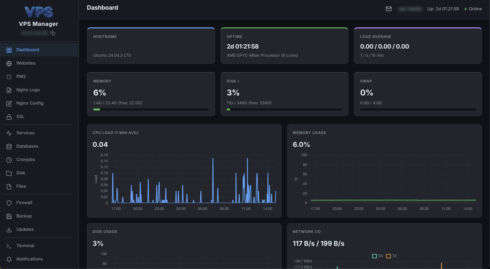

# VPS Manager

Web dashboard for managing Ubuntu VPS servers. Runs on the VPS itself and provides a complete management interface via the browser. Built for Ubuntu/Debian systems using `apt`, `systemctl`, `ufw`, and `fail2ban`.




## Features

### Server Management
- **Server Overview** - CPU, RAM, disk, swap, load average, uptime with real-time metrics charts
- **Service Monitoring** - Nginx, PHP-FPM, MariaDB, Fail2ban status with restart/stop/start and bulk actions
- **Process Manager** - Top 25 processes sorted by memory or CPU, kill functionality
- **Network Overview** - Network interfaces, listening ports, active connection count
- **System Updates** - Categorized updates (security, regular, phased, ESM) with one-click install
- **Auto-Update** - Check GitHub releases, one-click self-update with git pull + PM2 restart

### Web & Application
- **Website Management** - All hosted sites with HTTP status checks
- **Uptime Monitoring** - HTTP health checks for all sites, response time history chart (24h), dashboard alerts on downtime
- **PM2 Processes** - Node.js process management (restart, stop, logs) with bulk actions
- **Nginx Logs** - Expandable error entries, per-site log viewer, PHP-FPM errors
- **Nginx Config Editor** - Edit, enable/disable site configs with built-in `nginx -t` validation and syntax highlighting
- **SSL Certificates** - Expiry dates, warnings, and auto-renewal status
- **DNS Record Viewer** - Per-domain DNS lookup (A, AAAA, MX, CNAME, TXT, NS records)
- **PHP Management** - Installed PHP versions, FPM pool status, per-site PHP mapping, FPM restart
- **MariaDB Databases** - Database sizes, table counts, phpMyAdmin link

### System Tools
- **Cronjob Editor** - Full CRUD for user and root crontabs with schedule validation, human-readable descriptions
- **Disk Usage** - Per-site disk usage breakdown
- **File Browser & Editor** - Browse, upload (drag & drop, multi-file), download, delete, permission management (chmod matrix + chown), in-browser file editing
- **Web Terminal** - Browser-based command execution

### Security
- **Firewall & Security** - UFW rules, Fail2ban config, IP banning/unbanning, ban duration tracking, whitelist management
- **DDoS Detection** - Connection monitoring, SYN flood detection, per-IP thresholds
- **2FA Authentication** - TOTP two-factor auth with QR code setup
- **Backup Monitoring** - Status tracking, history timeline, backup file downloads, webhook endpoint
- **Audit Log** - Full audit trail for all actions with user, IP, and timestamp

### UX & Interface
- **Command Palette** - Quick navigation with `Ctrl+K` / `Cmd+K`, fuzzy search across all pages
- **Collapsible Sidebar** - Grouped navigation (Web, Server, Security, Tools) with persistent state
- **Info Tooltips** - Contextual help on all card headers explaining technical concepts
- **In-place Updates** - Actions update the UI instantly without page reloads
- **Bulk Actions** - Select multiple PM2 processes or services for batch restart/stop
- **Mobile Responsive** - Card-based table layout on small screens
- **Dashboard Quick Actions** - Restart services and PM2 processes directly from the dashboard
- **Persistent Alert Dismiss** - Dismissed alerts stay hidden across sessions
- **Push Notifications** - Web Push alerts for critical events, configurable categories, deduplication
- **PWA Support** - Install as a standalone app on desktop and mobile (see below)
- **Settings Panel** - All configuration via web UI, config validation, password management

## Quick Start

```bash
# Clone repository
git clone https://github.com/martijnrenkema/vps-manager.git
cd vps-manager

# Upload to VPS
rsync -avz --exclude='venv/' --exclude='data/' --exclude='__pycache__/' \
  web/ your-vps:/var/www/vps-manager/

# On VPS: setup
cd /var/www/vps-manager
python3 -m venv venv
venv/bin/pip install -r requirements.txt

# Set credentials
export VPS_MANAGER_USER=admin
export VPS_MANAGER_PASS=your-secure-password

# Run with PM2
pm2 start "cd /var/www/vps-manager && venv/bin/python app.py" \
  --name vps-manager
pm2 save
```

## Updating

The dashboard has a built-in auto-update system. Go to **Updates** in the sidebar to check for new versions and install them with one click. This requires the deployment directory to be a git repository:

```bash
# On VPS: initialize git (one-time setup)
cd /var/www/vps-manager
git init
git remote add origin https://github.com/martijnrenkema/vps-manager.git
git fetch origin && git reset --hard origin/main
```

After setup, updates are handled entirely through the web interface.

## Project Structure

```
web/
├── app.py              # Flask web dashboard
├── config.py           # Configuration loader with defaults
├── VERSION             # Current version number
├── vps-backup.sh       # VPS backup script
├── requirements.txt    # Python dependencies
├── static/
│   ├── style.css       # Dark theme stylesheet
│   ├── sw.js           # Service worker (push notifications)
│   ├── manifest.json   # PWA manifest
│   └── *.png           # App icons
└── templates/
    ├── base.html        # Layout with sidebar navigation
    ├── login.html       # Login + 2FA
    ├── dashboard.html   # Server overview with metrics charts
    ├── websites.html    # Hosted sites
    ├── uptime.html      # Uptime monitoring with response chart
    ├── pm2.html         # PM2 processes
    ├── nginx_logs.html  # Log viewer
    ├── nginx_config.html # Nginx site config editor
    ├── ssl.html         # SSL certificates
    ├── dns.html         # DNS record viewer
    ├── services.html    # Service monitoring
    ├── processes.html   # System process manager
    ├── network.html     # Network interfaces & ports
    ├── databases.html   # MariaDB databases
    ├── php.html         # PHP version & FPM management
    ├── cronjobs.html    # Cronjob CRUD editor & timers
    ├── disk.html        # Disk usage
    ├── files.html       # File browser, editor & permissions
    ├── firewall.html    # Firewall, banning & whitelist
    ├── backup.html      # Backup status & downloads
    ├── updates.html     # System + app updates
    ├── terminal.html    # Web terminal
    ├── notifications.html # Push notification settings
    ├── audit.html       # Audit log viewer
    ├── settings.html    # Configuration panel
    └── icons.html       # SVG icon macros
```

## Configuration

The dashboard uses `data/config.json` for all settings. On first run, defaults are used. Configuration can be changed via the Settings page or by editing the JSON file directly.

### Authentication

Set credentials via environment variables (recommended) or config:

```bash
export VPS_MANAGER_USER=admin
export VPS_MANAGER_PASS=your-password
```

### Monitored Services

Default: `nginx`, `php8.3-fpm`, `mariadb`, `fail2ban`. Configurable in settings.

### Alert Thresholds

| Metric | Warning | Critical |
|--------|---------|----------|
| Disk usage | 80% | 95% |
| Memory usage | 85% | - |
| Swap usage | 50% | - |
| SSL expiry | 14 days | 3 days |

### Push Notifications

Web Push notifications with configurable categories:

| Category | Default | Triggers |
|----------|---------|----------|
| Critical Errors | On | Site down, services down, disk >95%, SSL expired |
| Warnings | On | Disk >80%, RAM >85%, high load |
| Security | On | Fail2ban bans, suspicious SSH activity |
| DDoS Detection | On | High connections, SYN floods |
| Backup | On | Backup failures, no backup in 48h |
| System Updates | Off | Available package updates |

## PWA (Progressive Web App)

VPS Manager can be installed as a standalone app on any device. This is especially useful for push notifications — browsers only deliver Web Push notifications to installed PWAs or pages with an active service worker.

**Benefits of installing as PWA:**
- **Push notifications** work reliably in the background, even when the browser is closed
- **Standalone window** without browser chrome (address bar, tabs) for a native app feel
- **Home screen / dock icon** for quick access
- **Offline fallback** for static assets (icons, styles) via service worker caching
- **Faster loading** through cached static assets

**How to install:**
- **Desktop (Chrome/Edge):** Click the install icon in the address bar, or use the install banner that appears at the bottom
- **iOS Safari:** Tap the share button, then "Add to Home Screen"
- **Android Chrome:** Tap the three-dot menu, then "Install app" or use the install banner

The PWA uses a network-first strategy for pages and API calls (server data is always live), and cache-first for static assets (icons, fonts).

## Backup Monitoring

The dashboard tracks backup status via a webhook endpoint (`POST /api/backup/webhook`). No extra ports or inbound connections are needed — the architecture is designed so all connections are outbound or local:

1. **VPS backup script** runs via cron, reports status to `http://127.0.0.1:5050` (localhost)
2. **Remote backup pull** (e.g. NAS) connects to VPS via SSH to rsync files, then reports status to the dashboard's public HTTPS URL

```
┌─────────┐  03:00 cron   ┌──────────────────────┐
│   VPS   │──────────────→ │  vps-backup.sh       │
│         │                │  webhook → localhost  │
│         │                └──────────────────────┘
│         │
│         │  03:30 cron   ┌──────────────────────┐
│         │ ←─── SSH ──── │  NAS pull-backup.sh  │
│         │               │  webhook → HTTPS     │
└─────────┘               └──────────────────────┘
```

### VPS Backup Script

Add webhook calls to your backup script on the VPS:

```bash
WEBHOOK_URL="http://127.0.0.1:5050/api/backup/webhook"
WEBHOOK_SECRET="your-webhook-secret"  # Set in Settings > Backup

# Trap errors for failure reporting
report_failure() {
    curl -s -X POST "$WEBHOOK_URL" \
        -H "Content-Type: application/json" \
        -H "X-Webhook-Secret: $WEBHOOK_SECRET" \
        -d "{\"status\": \"failure\", \"details\": \"$1\"}" > /dev/null 2>&1
}
trap 'report_failure "Backup failed at line $LINENO"' ERR
set -e

# ... your backup commands ...

# Report success at the end
curl -s -X POST "$WEBHOOK_URL" \
    -H "Content-Type: application/json" \
    -H "X-Webhook-Secret: $WEBHOOK_SECRET" \
    -d '{"status": "success", "details": "Backup completed"}' > /dev/null 2>&1
```

### Remote Pull Script (NAS / offsite)

For a remote machine that pulls backups via SSH and rsync:

```bash
WEBHOOK_URL="https://your-vps-dashboard.example.com/api/backup/webhook"
WEBHOOK_SECRET="your-webhook-secret"

rsync -avz --delete -e "ssh" user@vps:/var/backups/ /local/backups/

if [ $? -eq 0 ]; then
    curl -s -X POST "$WEBHOOK_URL" \
        -H "Content-Type: application/json" \
        -H "X-Webhook-Secret: $WEBHOOK_SECRET" \
        -d '{"status": "success", "details": "Pull completed"}'
else
    curl -s -X POST "$WEBHOOK_URL" \
        -H "Content-Type: application/json" \
        -H "X-Webhook-Secret: $WEBHOOK_SECRET" \
        -d '{"status": "failure", "details": "Pull failed"}'
fi
```

## Dependencies

- [Flask](https://flask.palletsprojects.com/) - Web framework
- [Flask-WTF](https://flask-wtf.readthedocs.io/) - CSRF protection
- [pywebpush](https://github.com/web-push-libs/pywebpush) - Web Push notifications
- [cryptography](https://cryptography.io/) - VAPID key generation
- [pyotp](https://github.com/pyauth/pyotp) - TOTP two-factor authentication
- [qrcode](https://github.com/lincolnloop/python-qrcode) - QR code generation for 2FA setup

## Nginx Configuration

Example Nginx reverse proxy config for the web dashboard:

```nginx
server {
    server_name vps.example.com;

    location / {
        proxy_pass http://127.0.0.1:5050;
        proxy_set_header Host $host;
        proxy_set_header X-Real-IP $remote_addr;
        proxy_set_header X-Forwarded-For $proxy_add_x_forwarded_for;
        proxy_set_header X-Forwarded-Proto $scheme;
    }

    listen 443 ssl;
    ssl_certificate /etc/letsencrypt/live/vps.example.com/fullchain.pem;
    ssl_certificate_key /etc/letsencrypt/live/vps.example.com/privkey.pem;
}
```

## License

MIT License - feel free to use and modify.
