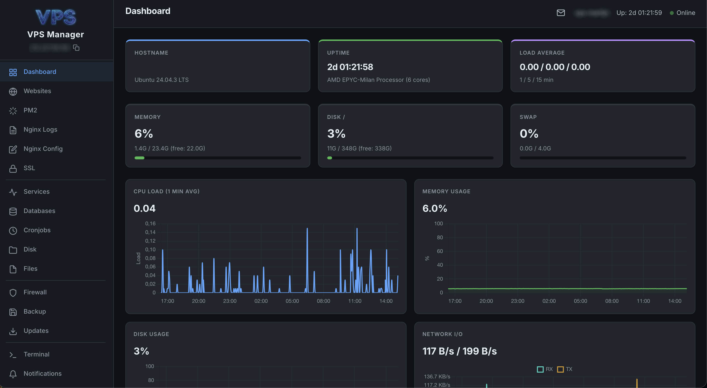

# VPS Manager

Web dashboard for managing Ubuntu VPS servers. Runs on the VPS itself and provides a complete management interface via the browser. Built for Ubuntu/Debian systems using `apt`, `systemctl`, `ufw`, and `fail2ban`.




## Features

### Server Management
- **Server Overview** - CPU, RAM, disk, swap, load average, uptime with real-time metrics charts
- **Service Monitoring** - Nginx, PHP-FPM, MariaDB, Fail2ban status with restart/stop/start and bulk actions
- **Process Manager** - Top 25 processes sorted by memory or CPU, kill functionality
- **Network Overview** - Network interfaces, listening ports, active connection count
- **System Updates** - Categorized updates (security, regular, phased, ESM) with one-click install
- **Auto-Update** - Check GitHub releases, streaming self-update with real-time step-by-step progress via SSE

### Web & Application
- **Website Management** - All hosted sites with HTTP status checks (Nginx and Caddy)
- **Uptime Monitoring** - HTTP health checks for all sites, response time history chart (24h), dashboard alerts on downtime
- **PM2 Processes** - Node.js process management (restart, stop, logs) with bulk actions
- **Nginx / Caddy Support** - Full support for both web servers (either/or, configurable in Settings with auto-detection)
- **Web Server Logs** - Expandable error entries, per-site log viewer, PHP-FPM errors (Nginx plain text + Caddy JSON format)
- **Config Editor** - Edit site configs with syntax highlighting: Nginx (`nginx -t` validation, enable/disable via symlinks) or Caddyfile (`caddy validate`, enable/disable via `.disabled` extension)
- **SSL Certificates** - Nginx: Let's Encrypt via certbot with manual renewal. Caddy: automatic HTTPS via built-in ACME
- **DNS Record Viewer** - Per-domain DNS lookup (A, AAAA, MX, CNAME, TXT, NS records)
- **PHP Management** - Installed PHP versions, FPM pool status, per-site PHP mapping, FPM restart
- **MariaDB Databases** - Database sizes, table counts, phpMyAdmin link

### System Tools
- **Cronjob Editor** - Full CRUD for user and root crontabs with schedule validation, human-readable descriptions
- **Disk Usage** - Per-site disk usage breakdown
- **File Browser & Editor** - Browse, upload (drag & drop, multi-file), download, delete, permission management (chmod matrix + chown), in-browser file editing
- **Web Terminal** - Browser-based command execution with allowlist-based command filtering

### Security
- **Firewall & Security** - UFW rules, Fail2ban config, IP banning/unbanning, ban duration tracking, whitelist management
- **DDoS Detection** - Connection monitoring, SYN flood detection, per-IP thresholds
- **2FA Authentication** - TOTP authenticator app or email-based 2FA with configurable SMTP
- **Backup Monitoring** - Status tracking, history timeline, backup file downloads, webhook endpoint
- **Audit Log** - Full audit trail for all actions with user, IP, and timestamp
- **Terminal Allowlist** - Command allowlist approach with subshell escape blocking, all blocked commands logged
- **Symlink Protection** - File browser resolves symlinks to prevent directory traversal escapes
- **Atomic JSON Writes** - All config and state files written atomically via temp file + rename to prevent corruption
- **Minimal External Dependencies** - Bootstrap and fonts served locally; only Chart.js (dashboard/uptime charts) is loaded from a CDN

### UX & Interface
- **Command Palette** - Quick navigation with `Ctrl+K` / `Cmd+K`, fuzzy search across all pages
- **Collapsible Sidebar** - Grouped navigation (Web, Server, Security, Tools) with persistent state
- **Info Tooltips** - Contextual help on all card headers explaining technical concepts
- **In-place Updates** - Actions update the UI instantly without page reloads
- **Bulk Actions** - Select multiple PM2 processes or services for batch restart/stop
- **Mobile Responsive** - Card-based table layout on small screens
- **Dashboard Quick Actions** - Restart services and PM2 processes directly from the dashboard
- **Persistent Alert Dismiss** - Dismissed alerts stay hidden across sessions
- **Push Notifications** - Web Push alerts for critical events, configurable categories, deduplication
- **PWA Support** - Install as a standalone app on desktop and mobile (see below)
- **Settings Panel** - All configuration via web UI, config validation, password management

## Quick Start

```bash
# Clone repository
git clone https://github.com/martijnrenkema/vps-manager.git
cd vps-manager

# Upload to VPS
rsync -avz --exclude='venv/' --exclude='data/' --exclude='__pycache__/' \
  web/ your-vps:/var/www/vps-manager/

# On VPS: setup
cd /var/www/vps-manager
python3 -m venv venv
venv/bin/pip install -r requirements.txt

# Set credentials
export VPS_MANAGER_USER=admin
export VPS_MANAGER_PASS=your-secure-password

# Run with PM2
pm2 start "cd /var/www/vps-manager && venv/bin/python app.py" \
  --name vps-manager
pm2 save
```

The app serves via [Waitress](https://docs.pylonsproject.org/projects/waitress/)
(production WSGI server) and exposes an unauthenticated `GET /health` endpoint
for uptime monitoring, PM2 health checks, or reverse proxy checks.

Self-updates installed via the Updates page are guarded by a watchdog: if the
freshly restarted app fails its health check, the update is automatically
rolled back to the previous version and a notification is recorded.

## Updating

The dashboard has a built-in auto-update system. Go to **Updates** in the sidebar to check for new versions and install with a visual step-by-step progress indicator (git fetch, file install, dependency check, cache clear, restart). This requires the deployment directory to be a git repository:

```bash
# On VPS: initialize git (one-time setup)
cd /var/www/vps-manager
git init
git remote add origin https://github.com/martijnrenkema/vps-manager.git
git fetch origin && git reset --hard origin/main
```

After setup, updates are handled entirely through the web interface.

## Project Structure

```
web/
├── app.py              # Flask web dashboard
├── config.py           # Configuration loader with defaults
├── VERSION             # Current version number
├── vps-backup.sh       # VPS backup script
├── nas-pull-backup.sh  # Synology/NAS pull + verify + snapshot script
├── requirements.txt    # Python dependencies
├── static/
│   ├── style.css       # Dark theme stylesheet
│   ├── sw.js           # Service worker (push notifications)
│   ├── manifest.json   # PWA manifest
│   ├── *.png           # App icons
│   └── vendor/         # Bootstrap CSS/JS + Inter font (no CDN)
└── templates/
    ├── base.html        # Layout with sidebar navigation
    ├── login.html       # Login + 2FA
    ├── dashboard.html   # Server overview with metrics charts
    ├── websites.html    # Hosted sites
    ├── uptime.html      # Uptime monitoring with response chart
    ├── pm2.html         # PM2 processes
    ├── nginx_logs.html  # Nginx log viewer
    ├── nginx_config.html # Nginx site config editor
    ├── caddy_logs.html  # Caddy log viewer (JSON format)
    ├── caddy_config.html # Caddy config editor
    ├── ssl.html         # SSL certificates (certbot + Caddy auto-HTTPS)
    ├── dns.html         # DNS record viewer
    ├── services.html    # Service monitoring
    ├── processes.html   # System process manager
    ├── network.html     # Network interfaces & ports
    ├── databases.html   # MariaDB databases
    ├── php.html         # PHP version & FPM management
    ├── cronjobs.html    # Cronjob CRUD editor & timers
    ├── disk.html        # Disk usage
    ├── files.html       # File browser, editor & permissions
    ├── firewall.html    # Firewall, banning & whitelist
    ├── backup.html      # Backup status & downloads
    ├── updates.html     # System + app updates
    ├── terminal.html    # Web terminal
    ├── notifications.html # Push notification settings
    ├── audit.html       # Audit log viewer
    ├── settings.html    # Configuration panel
    └── icons.html       # SVG icon macros
```

## Configuration

The dashboard uses `data/config.json` for all settings. On first run, defaults are used. Configuration can be changed via the Settings page or by editing the JSON file directly.

### Authentication

Set credentials via environment variables (recommended) or config:

```bash
export VPS_MANAGER_USER=admin
export VPS_MANAGER_PASS=your-password
```

### Web Server

Supports both **Nginx** and **Caddy** as the web server. Configure in Settings with auto-detection. The entire dashboard adapts: site listing, config editor, log viewer, SSL management, sidebar labels, and command palette.

### Monitored Services

Default: `nginx`, `php8.3-fpm`, `mariadb`, `fail2ban`. Configurable in settings. When using Caddy, replace `nginx` with `caddy` (auto-detected via the Detect button).

### Alert Thresholds

| Metric | Warning | Critical |
|--------|---------|----------|
| Disk usage | 80% | 95% |
| Memory usage | 85% | - |
| Swap usage | 50% | - |
| SSL expiry | 14 days | 3 days |

### Push Notifications

Web Push notifications with configurable categories:

| Category | Default | Triggers |
|----------|---------|----------|
| Critical Errors | On | Site down, services down, disk >95%, SSL expired |
| Warnings | On | Disk >80%, RAM >85%, high load |
| Security | On | Fail2ban bans, suspicious SSH activity |
| DDoS Detection | On | High connections, SYN floods |
| Backup | On | Backup failures, no backup in 48h |
| System Updates | Off | Available package updates |

## PWA (Progressive Web App)

VPS Manager can be installed as a standalone app on any device. This is especially useful for push notifications — browsers only deliver Web Push notifications to installed PWAs or pages with an active service worker.

**Benefits of installing as PWA:**
- **Push notifications** work reliably in the background, even when the browser is closed
- **Standalone window** without browser chrome (address bar, tabs) for a native app feel
- **Home screen / dock icon** for quick access
- **Offline fallback** for static assets (icons, styles) via service worker caching
- **Faster loading** through cached static assets

**How to install:**
- **Desktop (Chrome/Edge):** Click the install icon in the address bar, or use the install banner that appears at the bottom
- **iOS Safari:** Tap the share button, then "Add to Home Screen"
- **Android Chrome:** Tap the three-dot menu, then "Install app" or use the install banner

The PWA uses a network-first strategy for pages and API calls (server data is always live), and cache-first for static assets (icons, fonts).

## Backup Monitoring

The dashboard tracks backup status via a webhook endpoint (`POST /api/backup/webhook`). No extra ports or inbound connections are needed — the architecture is designed so all connections are outbound or local:

1. **VPS backup script** runs via cron, reports status to `http://127.0.0.1:5050` (localhost)
2. **Remote backup pull** (e.g. NAS) connects to VPS via SSH to rsync files, then reports status to the dashboard's public HTTPS URL

```
┌─────────┐  03:00 cron   ┌──────────────────────┐
│   VPS   │──────────────→ │  vps-backup.sh       │
│         │                │  webhook → localhost  │
│         │                └──────────────────────┘
│         │
│         │  03:30 cron   ┌──────────────────────┐
│         │ ←─── SSH ──── │  NAS pull-backup.sh  │
│         │               │  webhook → HTTPS     │
└─────────┘               └──────────────────────┘
```

### VPS Backup Script

Install the VPS-side script as root:

```bash
sudo install -m 750 web/vps-backup.sh /usr/local/bin/vps-backup.sh
sudo install -m 640 /dev/null /var/www/vps-manager/data/.backup_env
sudo sh -c 'printf "WEBHOOK_SECRET=%s\n" "your-webhook-secret" > /var/www/vps-manager/data/.backup_env'
echo '0 3 * * * root /usr/local/bin/vps-backup.sh' | sudo tee /etc/cron.d/vps-backup
sudo cp deploy/logrotate-vps-manager /etc/logrotate.d/vps-manager
```

What it backs up:
- MariaDB dumps for all non-system databases, plus SQLite `.db` files under included sites.
- Site data from `/var/www`, excluding `html` and the manager's own directory (`vps-manager`) by default — override with `SKIP_DIRS` in `.backup_env`.
- WordPress `wp-content` uploads/themes/plugins and custom root files, without WordPress core.
- Node/Python/static site files without rebuildable dependencies such as `node_modules`, `.next`, `venv`, `.git`, caches, logs and bytecode.
- Nginx/Caddy, Let's Encrypt, cron/systemd/PHP/MySQL/fail2ban/UFW/SSH metadata, plus selected site `.env` and `wp-config.php` files.
- VPS Manager state (`data/` with `config.json`, secret key, VAPID keys) — these are not in git, so this tarball is the only way to recover 2FA and push subscriptions.
- A daily checksum manifest covering current-day DB/config files and all mirrored site files.

### Remote Pull Script (NAS / offsite)

Install the NAS-side script on Synology:

```bash
mkdir -p /volume1/Backup/vps
install -m 750 web/nas-pull-backup.sh /volume1/Backup/vps/pull-backup.sh
install -m 600 /dev/null /volume1/Backup/vps/.backup_env
cat > /volume1/Backup/vps/.backup_env <<'EOC'
VPS=youruser@your-vps-hostname
SSH_PORT=22
WEBHOOK_URL=https://your-dashboard-domain/api/backup/webhook
WEBHOOK_SECRET=your-webhook-secret
EOC
```

Configure Synology Task Scheduler to run:

```bash
/bin/bash /volume1/Backup/vps/pull-backup.sh
```

The NAS script:
- Pulls `/var/backups/vps/` to `/volume1/Backup/vps/data/`.
- Uses a lock file to prevent overlapping runs.
- Verifies the latest checksum manifest and reports failure if any checksum fails.
- Creates daily hard-link snapshots in `/volume1/Backup/vps/snapshots/YYYYMMDD`.
- Keeps snapshots for 14 days by default (`RETENTION_DAYS=14`).

### Restore Checklist

Use the matching dated NAS snapshot when restoring site files:

```bash
cd /volume1/Backup/vps/snapshots/YYYYMMDD
sha256sum -c checksums_YYYYMMDD.sha256
```

Restore order:
1. Reinstall base OS packages, Nginx/Caddy, MariaDB/PHP/Node/Python as needed.
2. Restore `/etc` web/system config from `configs/*_YYYYMMDD.tar.gz`.
3. Restore site files from `sites/<site>/`.
4. Restore `.env` / `wp-config.php` from `configs/`.
5. Restore MariaDB with `gunzip -c databases/<db>_YYYYMMDD.sql.gz | mysql`.
6. Restore SQLite `.db` files to their original paths and fix ownership.
7. Restore the VPS Manager `data/` directory from `configs/vps-manager-data_YYYYMMDD.tar.gz` (2FA, secret key, VAPID keys, settings).
8. Restart services/PM2 and verify HTTP, database login and SSL.

## Dependencies

- [Flask](https://flask.palletsprojects.com/) - Web framework
- [Waitress](https://docs.pylonsproject.org/projects/waitress/) - Production WSGI server
- [Flask-WTF](https://flask-wtf.readthedocs.io/) - CSRF protection
- [pywebpush](https://github.com/web-push-libs/pywebpush) - Web Push notifications
- [cryptography](https://cryptography.io/) - VAPID key generation
- [pyotp](https://github.com/pyauth/pyotp) - TOTP two-factor authentication
- [qrcode](https://github.com/lincolnloop/python-qrcode) - QR code generation for 2FA setup

## Reverse Proxy Configuration

Example reverse proxy config for the web dashboard:

### Nginx

```nginx
server {
    server_name vps.example.com;

    location / {
        proxy_pass http://127.0.0.1:5050;
        proxy_set_header Host $host;
        proxy_set_header X-Real-IP $remote_addr;
        proxy_set_header X-Forwarded-For $proxy_add_x_forwarded_for;
        proxy_set_header X-Forwarded-Proto $scheme;
    }

    listen 443 ssl;
    ssl_certificate /etc/letsencrypt/live/vps.example.com/fullchain.pem;
    ssl_certificate_key /etc/letsencrypt/live/vps.example.com/privkey.pem;
}
```

### Caddy

```caddyfile
vps.example.com {
    reverse_proxy localhost:5050
}
```

Caddy automatically provisions and renews SSL certificates via Let's Encrypt.

## Changelog

### v1.10.0 - Security Audit, Self-Healing Services & Smarter Alerts
- **Security Audit page** - Nine read-only hardening checks with a weighted score and concrete recommendations: SSH root login & password authentication (effective `sshd -T` config), UFW active, fail2ban running, unattended-upgrades enabled, pending security updates, pending reboot, dashboard 2FA, backup freshness, and unexpected publicly listening ports
- **Self-healing services (opt-in)** - The monitor automatically restarts a down service (capped per service per 24h, default 3×) with audit logging and notifications; a service that keeps failing triggers a "gave up" alert instead of an endless restart loop
- **Predictive disk-full alert** - A linear fit over the collected metrics history warns when `/` is projected to be full within 14 days (error within 3 days) — before the disk fills up, not after
- **Reboot-required alert** - Detects `/var/run/reboot-required` (e.g. kernel updates) and surfaces it on the dashboard and in the daily update notification
- **Health score** - The dashboard shows an overall 0-100 health score computed from active alerts, with color-coded label
- **Fix: dashboard restart button never worked** - It called `/service/<name>/restart` while the route is `/services/restart/<name>`; every click was a silent 404
- **Fix: monitor loop skipped its pause after the first cycle** - After seeding existing alerts at startup, `continue` bypassed the pacing sleep and immediately started a second full monitoring cycle
- **Fix: IPv6 addresses could not be banned/unbanned** - fail2ban bans IPv6 too, but the ban/unban endpoints only accepted IPv4
- **Fix: HTTP 500 on non-ASCII 2FA codes** - TOTP and email code verification now compare bytes; garbage input gets "Invalid code" instead of a server error
- **Fix: websites page could crash** - An nginx `access_log`/`error_log` directive without a value caused an `IndexError` that broke the whole site list
- **Fix: push preferences for an unknown device reported success** - Now returns 404, consistent with the per-device endpoint

### v1.9.0 - Production Server, Update Rollback & Bug Fixes
- **Production WSGI server** - The app now serves via waitress instead of the Flask dev server (with automatic fallback if waitress is missing); SSE update progress streams per event
- **Self-update rollback watchdog** - The updater arms a detached watchdog before restarting; if the new version fails its `/health` check, it automatically rolls back to the previous commit, restarts, and records an audit entry plus a notification. A broken release can no longer leave the dashboard unreachable
- **Health endpoint** - New unauthenticated `GET /health` for uptime monitoring, PM2 health checks and reverse proxy checks
- **Manager state now backed up** - `vps-backup.sh` includes the manager's `data/` directory (settings, 2FA secret, session key, VAPID keys) as a separate tarball; previously a disk failure meant a 2FA lockout and losing all push subscriptions
- **TOTP replay protection** - Each 2FA time step is accepted at most once, so an observed/intercepted code cannot be reused within its validity window
- **Session fixation protection** - The session is fully regenerated on every successful login
- **Fix: corrupt config silently wiped** - A corrupt `config.json` is now logged and preserved as `config.json.corrupt` instead of being silently replaced with defaults on the next save
- **Fix: NAS webhook broke on multi-line errors** - `json_escape` in `nas-pull-backup.sh` now escapes newlines/control characters, so failure reports with rsync output no longer produce invalid JSON
- **Fix: backup script could report success on partial failure** - `find | while` pipe subshells hid errors from `set -e`/the ERR trap; replaced with process substitution
- **Fix: file browser symlink handling** - All file routes resolve symlinks consistently (realpath) for both the permission check and the actual access; deleting a symlink now removes the link itself (deleting a directory symlink previously errored)
- **IPv6 support in firewall** - Whitelist and UFW rule validation now accept IPv6 addresses and CIDR (server and client side)
- **Faster website checks** - Per-site HTTP status checks (Nginx and Caddy) run in parallel instead of sequentially; with many sites this cuts page load from the sum of all checks to the slowest single check
- **Memory housekeeping** - Expired TTL/IP-geolocation cache entries are swept periodically instead of accumulating forever
- **Security headers** - Added `Strict-Transport-Security` (HSTS)
- **Generic defaults** - Removed environment-specific values (deploy paths, usernames, hostnames) from the backup scripts and file browser; everything is configurable via `.backup_env` and the file browser enumerates real system accounts
- **Dependency pinning & CI** - `requirements.txt` now uses bounded version ranges; new GitHub Actions workflow runs syntax checks, critical lint and shell checks on every push
- **Misc** - Login page uses the locally vendored Inter font (Google Fonts reference removed), logrotate config shipped in `deploy/`, UFW table refresh errors now show feedback instead of failing silently, shared HTML escaping helper deduplicated

### v1.8.0 - Security & Robustness Hardening
- **Web terminal locked down** - Removed interpreters that can spawn commands or files (awk, sed, find, xargs, php, git, tar, mysql) from the allowlist, rejected sudo flags (`sudo -u ...`), and blocked command substitution/process substitution/newlines. Previously a logged-in user could obtain a root shell via e.g. `sudo awk 'BEGIN{system("id")}'`
- **Root cronjobs require confirmation** - Adding or running a cronjob that runs as root now asks for explicit confirmation in the UI, and all cron actions are recorded in the audit log
- **Fix: DDoS detection never fired** - `ss` with a state filter omits the State column, so the per-IP connection count read the wrong column (`$5` instead of `$4`) and the "Possible DDoS" alert could never trigger
- **Fix: Caddy log block inserted reversed** - This made `caddy validate` fail, so in Caddy mode the app rewrote all configs on every cache expiry, failed validation, and rolled back — in a loop
- **Fix: monitor crash without alerts** - `cooldown` was only assigned inside `if alerts:` but used unconditionally in the cleanup; after a restart with stale entries every monitor cycle crashed silently
- **Concurrency races resolved** - Shared locks around read-modify-write of `subscriptions.json` / `notification_log.json` / `notification_history.json` and all config writers (password, 2FA, SMTP, notification preferences, dismiss alert), so the monitor thread and web requests no longer overwrite each other's changes
- **More robust self-update** - Now aborts before the restart if git reset, the file copy or pip install fails (no more half-applied updates), always runs `pip install`, and restarts via a delayed thread so the response is sent first
- **Push notifications** - Broader error handling so one broken subscription doesn't break the send loop, and cooldown state is persisted immediately after every successful push (no more duplicate notifications after a network error)
- **Faster IP geolocation** - Lookups are cached per IP (24h) and fetched in parallel with a hard time limit, instead of up to 100 sequential calls that could block the SSH logs page for minutes
- **CLI tool** - Deploy now stops on a failed `npm install`/`build` (no broken build going live), all SSH/local calls have timeouts, `rsync --delete` is preceded by a source check (prevents wiping the remote on an empty/unmounted source), and source paths are resolved per OS (Linux vs macOS)
- **Stored XSS fixed** - `escHtml()`/`escapeHtml()` now also escape quotes, so a malicious country name from the external geo API cannot break out of a `title="..."` attribute
- **Security headers** - Added Content-Security-Policy, `X-Frame-Options: DENY`, `X-Content-Type-Options: nosniff` and `Referrer-Policy`; ProxyFix so rate limiting and audit logs see the real client IP; server binds to loopback by default; timing-safe username comparison; logout via CSRF-protected POST; Caddy SSL expiry in UTC; auth.log parser now also understands Ubuntu 24.04's ISO8601 format

### v1.7.5 - Daily Update Notification Window
- **Fix: duplicate/nighttime update notifications** - System and app update notifications are now batched and sent at most once per day, after a configurable time (default 08:00). Previously you could be woken at night when a new apt package or GitHub release appeared, and every change in the update count (5 → 6 available) produced yet another notification
- **New "Updates notification time" setting** - Configurable in Settings → Monitor & Notifications; pending update notifications wait for this time before being pushed/emailed
- **Applies to push and email** - Both channels use the same daily gate (separate markers per channel); dashboard alerts remain visible in real time

### v1.7.4 - PWA Icon Update Loop Fix
- **Fix: Android repeatedly prompting to update the icon** - The maskable icon variant in the manifest pointed to the same 512px PNG as the "any" purpose, while the VPS logo sits too close to the edges for a valid maskable safe zone (central 80%). This kept Chrome on Android queueing WebAPK updates. The maskable purpose was removed so Android uses the standard icon without masking
- **Service worker pre-cache cleaned up** - Removed the stale `/static/manifest.json` reference from the pre-cache list (the manifest is served from `/manifest.json` since v1.7.3); SW cache bumped to v4 so existing installs pick it up
- **Note for users:** if the "icon update" prompt keeps appearing on Android after this update, remove the PWA and reinstall it — that resets Chrome's WebAPK identity

### v1.7.3 - Uptime False Positives & PWA Install Fixes
- **Fix: false "site is down" alerts after reboot** - The uptime alert now requires two consecutive failed checks before a site is marked offline, preventing critical emails for sites still starting up after a VPS reboot
- **Fix: PWA not installable on Android** - The service worker was registered with `scope: '/'` from `/static/sw.js`, but Flask's static handler doesn't send a `Service-Worker-Allowed` header, so Chrome silently rejected the registration and the install prompt never appeared. The SW and manifest are now served from the app root with the correct headers
- **Improved manifest** - Added `scope`, `id` and a maskable icon for a better Android install experience
- **Fix: duplicate notification emails within the same minute** - Extra dedup on `(category, message)` within a single monitor cycle, so two alerts with different `key` fields but identical text no longer both produce an email; the notification log is also persisted immediately after every successful email so a second app process (e.g. a duplicate PM2 instance) sees the send and doesn't mail again

### v1.7.2 - Email Notification Dedup Fixes
- **Fix: duplicate emails on flapping alerts** - Values oscillating around a threshold (RAM, disk, load) could trigger a new email every 5 minutes because the cooldown entry was cleared too early; resolved alerts now keep their cooldown
- **Fix: notification burst after restart** - The first monitor cycle after a (re)start seeds the notification log with existing alerts without sending, preventing all active alerts from being emailed at once

### v1.7.1 - Notification Fixes & 2FA Email Improvements
- **Code in subject line** - The verification code is now visible in the email subject for quick recognition on your phone
- **Smart copy support** - Adjusted the text pattern so Samsung/Android/iOS automatically detect the code and offer a "Copy" button in notification popups
- **Fix: notifications page hanging** - The page hung on "Checking notification support..." without an active PWA/service worker; email preferences now load immediately, independent of push status
- **Fix: Enable Push crash** - The button is now hidden when push is unavailable (it was clickable but crashed)
- **Fix: app_update missing from defaults** - Push subscribe and preference fallbacks now include all notification categories

### v1.7.0 - Email Notifications & SMTP Sender Name
- **Email notifications** - Per-category email alerts alongside push notifications (matrix UI with Push/Email columns)
- **SMTP sender name** - Configurable "From name" for outgoing emails (e.g. "VPS Manager")
- **Notification recipient** - Separate email address for alert notifications (defaults to from address)
- **Independent dedup** - Push and email notifications use separate cooldown tracking
- **Always-visible categories** - Notification categories card visible without active push subscription

### v1.6.1 - Banned IPs Pagination
- **Pagination** - Banned IPs list now paginated with 25/50/100 items per page selector
- **Search filter** - Search banned IPs by IP address, jail, country, or reason
- **Reason column** - Human-readable ban reasons (e.g. "SSH brute force", "Bot/scanner detected", "Repeat offender") based on jail type

### v1.6.0 - Email 2FA & SMTP Settings
- **Email 2FA** - Two-factor authentication via email as alternative to authenticator app (TOTP)
- **SMTP Settings** - Configure external SMTP server in Settings (host, port, encryption, credentials, from address)
- **2FA method choice** - Choose between Authenticator App or Email 2FA, switch between methods anytime
- **Email verification flow** - 6-digit codes with 10-minute expiry, resend button with 60s cooldown, brute-force protection (max 5 attempts)
- **Test email** - Send a test email directly from Settings to verify SMTP configuration
- **Security** - Timing-safe code comparison, SMTP connection leak protection, rate limiting on resend, no SMTP errors leaked to login page

### v1.5.8 - SSH Logs Layout & Persistent Settings
- **SSH Logs layout** - Compact SSH Overview panel, Top Attacking IPs takes full width, responsive grid
- **Persistent env settings** - Port, credentials auto-saved to `.env` before updates

### v1.5.7 - Persistent Environment Settings
- **Auto .env file** - Runtime settings (port, credentials) are automatically saved to `.env` before each update, preventing config loss
- **.env loader** - App loads `.env` file at startup (doesn't override existing env vars)
- **Configurable port** - `VPS_MANAGER_PORT` env var now persists across updates via `.env`

### v1.5.6 - Configurable Port & UX Improvements
- **Configurable port** - Set `VPS_MANAGER_PORT` environment variable to run on a custom port (default: 5050). Fixes port reset on update.
- **Dynamic sidebar** - PM2, PHP, Databases menu items auto-hidden when not installed
- **Services page** - Only shows actually installed services (no more phantom "inactive" entries)
- **Cronjobs UX** - Better schedule labels (Mon-Fri, 8-18:00), hidden raw cron expressions, no duplicate entries
- **Auto git init** - Update mechanism initializes git repo automatically on first use
- **Caddy parser fixes** - Fixed import path doubling, log directives leaking as domains, rollback on invalid config
- **Security** - Shell injection fixes, terminal bypass prevention, CSRF on SSE, XSS fixes

### v1.5.0 - Caddy Web Server Support
- **Caddy support** - Full Caddy web server support alongside Nginx (either/or model, configurable in Settings)
- **Caddyfile editor** - Config editor with Caddyfile syntax highlighting, validation (`caddy validate`), and site enable/disable
- **Caddy log viewer** - JSON log parsing with structured error/access log display, journalctl fallback
- **Caddy auto-HTTPS** - SSL certificate management via Caddy's built-in ACME (no certbot needed)
- **Auto-detection** - Detect installed web server automatically via Settings page
- **Dynamic UI** - Sidebar, command palette, SSL page, and websites page adapt based on active web server
- **Security hardening** - Path traversal protection on all Caddy config routes, log path validation, config path restrictions
- **CLI tool** - Auto-detection via SSH, Caddy sites/logs/SSL support, `--web-logs` alias

### v1.4.0 - Security Hardening
- Fixed 24 security audit findings across 5 priority levels
- Input validation, path traversal protection, CSRF hardening

### v1.3.0 - Uptime Monitoring & DNS
- Uptime monitoring with response time charts
- DNS record viewer per domain

### v1.2.0 - Push Notifications & PWA
- Web Push notifications with configurable categories
- PWA support with service worker

### v1.1.0 - File Browser & Cronjobs
- File browser with editor, upload, permissions
- Cronjob CRUD editor

### v1.0.0 - Initial Release
- Server dashboard with service monitoring
- Nginx config editor, SSL management
- Firewall, backup monitoring, audit log

## License

MIT License - feel free to use and modify.
